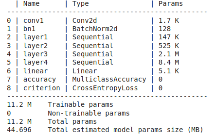
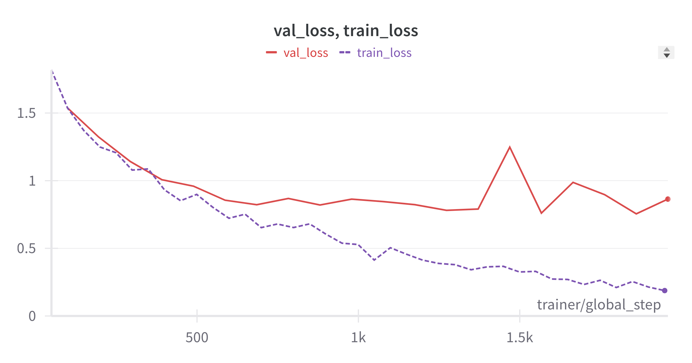
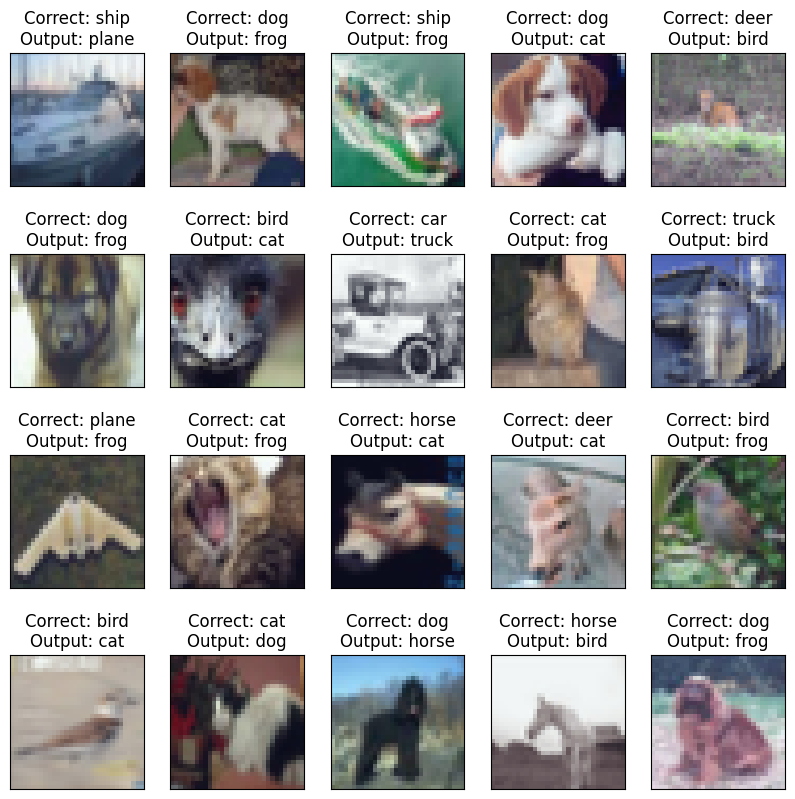
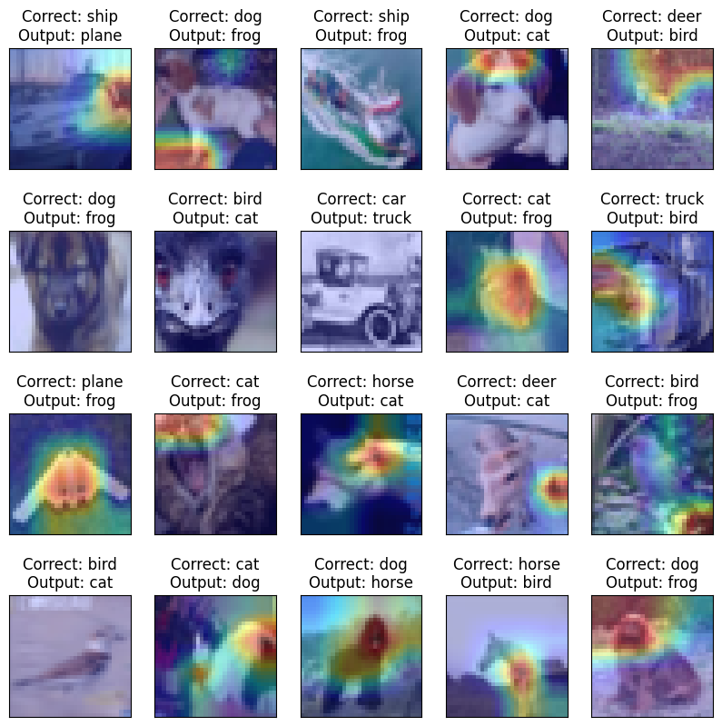

# Train ResNet18 model on CIFAR10 dataset

This repository contains the [Pytorch Lightning](https://lightning.ai/docs/pytorch/stable/) code to train a ResNet18 model on the CIFAR10 dataset.
The trained model was then hosted on HuggingFaces to perform inference. The app can be found here: [Link](https://huggingface.co/spaces/varsha-raveendran/gradcam_app_demo).

## Model Architecture

### Hyperparameters
* Number of Epochs: 20
* Batch size: 512
* Learning rate: 0.03 
* Scheduler: OneCycleLR policy

## Results
### Loss curves

### Misclassified images

